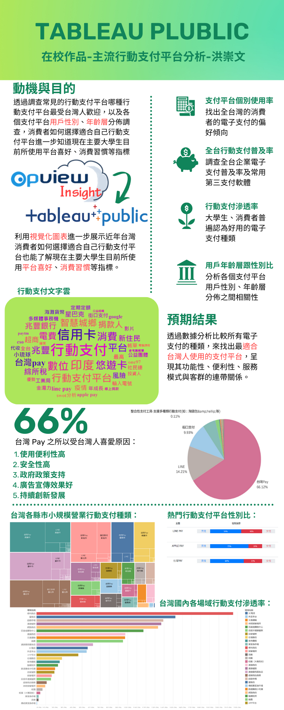

# HARRY
## HARRY
### HARRY
#### HARRY
##### HARRY
###### HARRY

# :sunny::dog::shit:




1.First ordered list item
2.Another item
Unordered sub-list.


- [ ] todo list 
- [ ] 2nd things
- [x] done


```python
S = "Python Syntax Highlighting"
print s
```
```javascript
var s = "Javascript Syntax Highlighting"
alert (s);
```

Emphasis, aka *italics,* with *asterisks* or *underscores.*
Strong emphasis, aka bold, with **asterisks** or **underscores.**
Combined emphasis with **asterisks and *underscores.***
Strikethrough uses two tildes. ~~Setateh this.~~
---

> 1. First ordered list item
> 2. Another item
>>  Unordered sub-list.
> 3. Actual numbers don't matter, just that it's a number
>> 1. Ordered sub-list
>> 2. 2nd
> 4. And another item.
>> note 1
>> note 2
>> note 3

| Tables        | Are           | Cool  |
| ------------- |:-------------:| ----:|
| col 3 is      | right-aligned | $1600 |
| col 2 is      |   centered    |   $12 |
| zebra stripes |    are neat   |    $1 |

| Markdown      | less          | Pretty|
| ------------- |:-------------:| -----:|
| *Still*       | `renders`     | **nicely**|
| 1             | 2             | 3|
